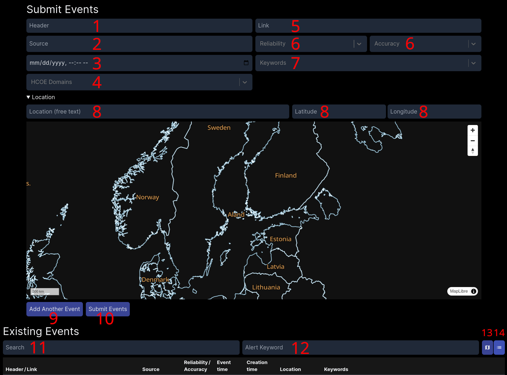

### Creating a new event

Livelog is platform to aggregate and enrich data brought from different sources.
All data in Livelog is handled in "events". Single event can contain following inputs:

1. Header
   * Header of the event.
2. Source
   - Where the data is coming from.
3. Date / time
   - Date and time of the event (this is the time when something happened, not when it was submitted to Livelog).
4. HCOE Domains
   - Categorization of the event based on Hybrid CoE classification.
5. Link
   - If the event was something that has permanent link (for example Facebook post/ news article, forum post, etc)
6. Admiralty code -> Reliability / Accuracy
   - https://en.wikipedia.org/wiki/Admiralty_code
7. Keywords
   - Tags/keywords to help group and search information.
   - Drop down menu will show and search existing keywords when user is inputting a new keyword.
8. Location
   - Geographic location of the event
   - Includes option to input coordinates and/or free text, if coordinates are unknown.
   - Location can also be set by using the provided map.

After inputting the event details, you can add another event by pressing the "Add Another Event" (9) or press "Submit Event" (10) to save already ready events.

### Searching existing events

Search (11) allows user to perform search of the database for existing events. It will also use fuzzy search to filter results real time while user is typing.

Alert Keyword (12) will highlight all events matching the user input.

Search and Alert can be used both together to narrow down results and mark important results more clearly.

Toggle Map icon (13) opens the map displaying all existing events that have coordinates set.

Toggle List icon (14) opens the list listing all events or events matching the user input.

### Viewing existing events

Permalink (15) opens the single event view. This link is also shareable and permanent/unique per event, so it remains unchanged and will always lead back to this event.

Map view (16) opens the Open Street Map view pointing to the coordinates, if coordinates were given when creating the event.

### Single event view

Displays all details from the selected event.

Upload media (17) allows user to add images for the event.